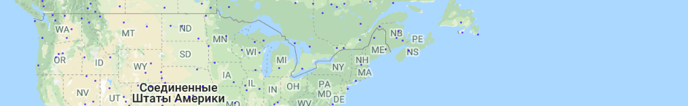

* ошибочность определения воды 0%
* в демонстрационных целях запрашиваются по 20 слуайных точек через graphql пока не наберется 100 точек не над водой. 
* запуск:  
npm i 
npm run dev 
<a target="_blank" href="http://localhost:4000">http://localhost:4000</a>

 

